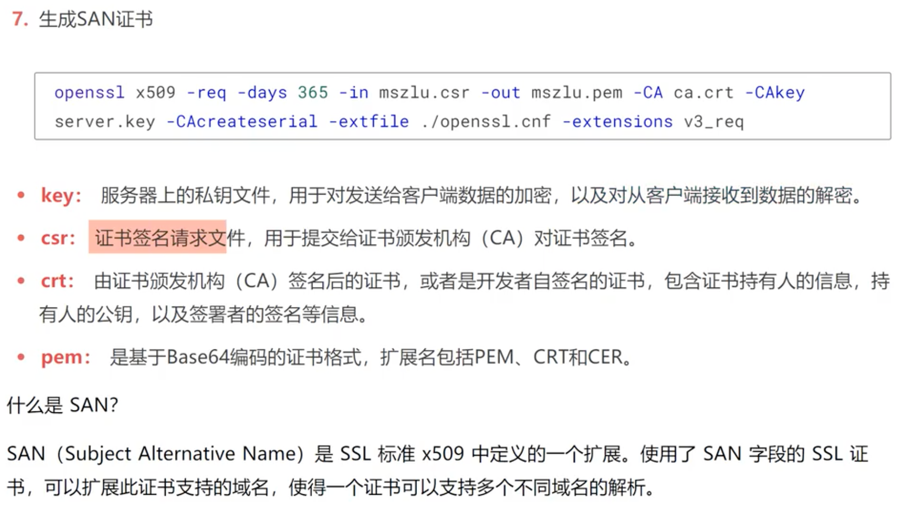

1.生成私钥

me@localhostt cert % pwd
/Users/me/Thebigwind/proto-demo/cert
me@localhostt cert % openssl
OpenSSL>  genrsa -des3 -out ca.key 2048
Generating RSA private key, 2048 bit long modulus
........................................................+++
..........................................+++
e is 65537 (0x10001)
Enter pass phrase for ca.key:
Verifying - Enter pass phrase for ca.key:
OpenSSL> 
密码： 123456

2.创建证书请求，公钥 ca.csr

openssl req -new -key ca.key -out ca.csr 

me@localhostt cert % openssl req -new -key ca.key -out ca.csr
Enter pass phrase for ca.key:
You are about to be asked to enter information that will be incorporated
into your certificate request.
What you are about to enter is what is called a Distinguished Name or a DN.
There are quite a few fields but you can leave some blank
For some fields there will be a default value,
If you enter '.', the field will be left blank.
-----
Country Name (2 letter code) []:cn
State or Province Name (full name) []:bj
Locality Name (eg, city) []:bj
Organization Name (eg, company) []:lxf
Organizational Unit Name (eg, section) []:tt
Common Name (eg, fully qualified host name) []:lxf.com
Email Address []:

Please enter the following 'extra' attributes
to be sent with your certificate request
A challenge password []:
me@localhostt cert %

3. 生成ca.crt 

openssl x509   -req -days 3650 -in ca.csr -signkey ca.key -out ca.cst 

me@localhostt cert % openssl x509   -req -days 3650 -in ca.csr -signkey ca.key -out ca.cst
Signature ok
subject=/C=cn/ST=bj/L=bj/O=lxf/OU=tt/CN=lxf.com
Getting Private key
Enter pass phrase for ca.key:
me@localhostt cert %

4. 找到 openssl.cnf 配置文件
   /private/etc/ssl/openssl.cnf

    subjectAltName                  = *.lxf.com

    [ alt_names ]
    DNS.1 = *.lxf.com

5. 生成证书私钥server.key
   me@localhostt cert % openssl genpkey -algorithm RSA -out server.key
   ....+++
   ..........................+++
   me@localhostt cert %
   

6. 通过server.key 生成证书请求文件server.csr 

 openssl req -new -nodes -key server.key -out server.csr -days 3650 -config  /private/etc/ssl/openssl.cnf -extensions v3_req 

7. 生成 SAN 证书

  openssl x509 -req -days 3650 -in server.csr -out server.perm -CA ca.crt -CAkey ca.key -CAcreateserial -extfile /private/etc/ssl/openssl.cnf -extensions v3_req

